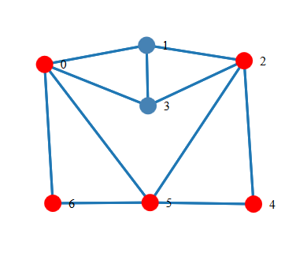

# Графы 1

**Задание**: Поиск всех гамильтоновых циклов в графе.

 Граф был реализован с помощью класса `graph`. Граф представлен в виде списка смежности.

 В качестве контейнера для списка смежности был выбран `std::map`. В качестве ключа - номер вершины графа. В качестве значения - список присоедененных вершин. Для хранения списка присоедененных вершин был выбран `std::set`.

 Оба контейнера были выбраны из предположения, что поиск(обращения к вершинам) будет происходить чаще чем вставка. Поиск и вставка: `O(logN)` против `O(N)` и `O(1)` в неотсортированных контейнерах.

 Поиск всех гамильтоновых циклов в графе осуществляется с помощью метода `findHamiltonCycles`. Метод возвращает двумерный массив, каждая строка которого является гамильтонвым циклом. Алгоритм поиска - перебор всех возможных путей в графе. Фактически, метод `recursiveHamiltonSearch` рекурсивно ищет все гамильтоновы пути в графе и при нахождении одного из путей проверяет есть ли ребро из последней вершины в первую. Поиск путей начинается из вершины на которую указывает поле `ptr_`. Для смены `ptr_` можно воспользоваться методом `traverse(id)`, где `id` - это номер _присоединенной к `ptr_` вершины_.

 Для визуализации используется библиотека `D3.js`, а именно `force - directed graph`. Для использования визуализации необходимо поместить `visual.html` и `graph.json` в одну директорию. `graph.json` можно получить с помощью метода `writeasJSON("graph.json")`.

## Пример

 В качестве примера в файле `graph.in` содержится следующий граф:

  

 Граф записан в виде матрицы смежности, которая выглядит следующим образом:

    7
    0  1  0  1  0  1  1
    1  0  1  1  0  0  0
    0  1  0  1  1  1  0
    1  1  1  0  0  0  0
    0  0  1  0  0  1  0
    1  0  1  0  1  0  1
    1  0  0  0  0  1  0

 Вывод программы при запуске с этим файлом:

  ```bash
  $ ./graphsalg -f graphs.in --hamilton

  0 --> 1 --> 3 --> 2 --> 4 --> 5 --> 6 -->
  0 --> 3 --> 1 --> 2 --> 4 --> 5 --> 6 -->
  0 --> 6 --> 5 --> 4 --> 2 --> 1 --> 3 -->
  0 --> 6 --> 5 --> 4 --> 2 --> 3 --> 1 -->
  ```
