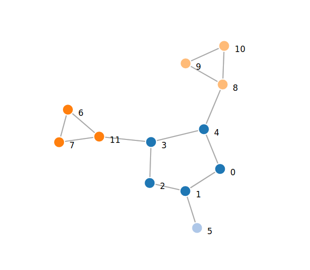

# Графы 2

 **Задание**: Поиск шарниров в графе.

 Поиск шарниров в графе осуществляется с помощью модифицированного   алгоритма поиска в глубину. Метод `recursiveGetAp` осуществляет   рекурсивный "спуск" по графу из вершины `ptr_`. 
  
 "Спуск" осуществляется по следующему алгоритму:

 1. _текущая_ (_T_) вершина помечается.
 2. `Dnum` (в коде это `depth`) и `low` этой вершины присваевается текущая глубина.
 3. Для каждой _присоединенной_ (_P_) к _текущей_ и не посещенной вершине выполняется:
    * 3.1 количество потомков _T_ + `1`
    * 3.2 предок _P_ := _T_ 
    * 3.3 переход на пункт 1 для _P_ (рекурсивный вызов функции "спуска" для _P_)
    * 3.4 `low[`_T_`] = min(low[`_T_`], low[`_P_`])`\
    * 3.5 Если у _T_ нет предка, но есть потомки: _T_ - шарнир
    * 3.6 Если у _T_ есть предок и `low[`_P_`] >= Dnum[`_T_`]`, то _T_ это шарнир.
 4. Если _P_ посещена и _P_ не предок _T_, то необходимо пересчитать `low[`_T_`] := min(low[`_T_`], low[`_P_`])`.

 Результатом выполнения метода `recursiveGetAp` будет массив `result` содержащий все шарниры графа и массив `groups` содержащий все компоненты связности.

## Пример

 В качестве примера в директории `samples` содержится файл `apgraph.in` в котором содержится следующий граф:

 
  
 Граф записан в виде матрицы смежности, которая выглядит следующим образом:

    12
    0 1 0 0 1 0 0 0 0 0 0 0
    1 0 1 0 0 1 0 0 0 0 0 0
    0 1 0 1 0 0 0 0 0 0 0 0
    0 0 1 0 1 0 0 0 0 0 0 1
    1 0 0 1 0 0 0 0 1 0 0 0
    0 1 0 0 0 0 0 0 0 0 0 0
    0 0 0 0 0 0 0 1 0 0 0 1
    0 0 0 0 0 0 1 0 0 0 0 1
    0 0 0 0 1 0 0 0 0 1 1 0
    0 0 0 0 0 0 0 0 1 0 1 0
    0 0 0 0 0 0 0 0 1 1 0 0
    0 0 0 1 0 0 1 1 0 0 0 0

 Найти шарниры в графе:

  ```bash
  ./graphsalg -f graph.in -a
  ```

 Найти шарниры в графе и записать "раскрашенный" граф в .json файл

  ```bash
  ./graphsalg -f graph.in -a -o graph.json -j
  ```

 Найти шарниры в графе, удалить их и записать получившийся граф в .json файл

 ```bash
 ./graphsalg -f graph.in -a -d -o graph.json -j
 ```

 Ввести граф с клавиатуры (как матрицу смежности) и найти шарниры в графе

  ```bash
  ./graphsalg -a
  ```

 Ввести граф с клавиатуры (как матрицу смежности), найти шарниры в графе, и записать получившийся граф в файл

  ```bash
  ./graphsalg -a -o graph.json -j
  ```

 Ввести граф с клавиатуры (как матрицу смежности), найти шарниры в графе, удалить шарниры и записать получившийся граф в файл

  ```bash
  ./graphsalg -a -d -o graph.json -j
  ```